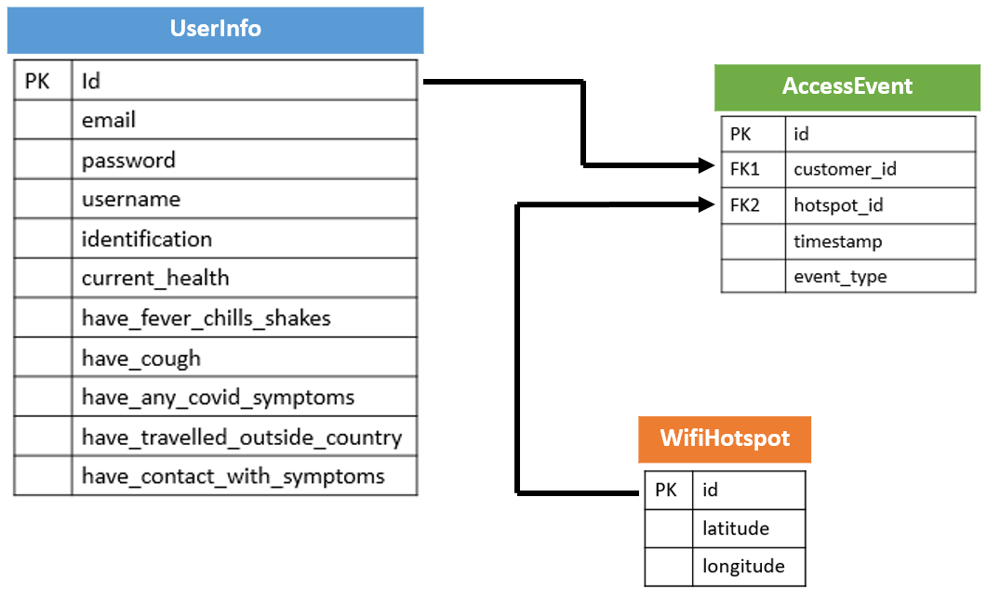

## Project: COVID19 Hackathon
### Github Repo Link: https://github.com/pmaganty/COVID19_hackathon
### Heroku Link: https://morning-eyrie-07110.herokuapp.com/
### Description: 

#### How to get project up and running on local machine:
+ Enter command "npm i" to grab all dependency libraries and generate node_modules folder
+ Copy code from "schema.sql" file and run in sql server to create database
+ Change password field to your connection password in config/config.json file
+ Run using "node server.js"
+ Open local host 8082

#### Contents:
+ config/
    - config.json: folder containing database connection configuration information generated by sequelize
+ models/
    - accessEvent.js: uses sequelize to create table for events in which wifihotspots are accessed
    - userInfo.js: uses sequelize to create table for all general info about user including login info
    - wifiHotspot.js: uses sequelize to create table for wifi hotspot info
    - index.js: configuration and setup info for sequelize to recognize models and routes
+ public/
    - assets/
        - script.js: 
    - test.html:
+ routes/
    - api-routes.js: includes all get, post, delete routes associated with api
    - html-routes.js: includes all get, post, delete routes associated with html
+ package.json: includes all dependency information
+ schema.sql: includes database create commands that user must enter into sql connection
+ server.js: main file to run that sets up localserver to listen on

#### Database information:
